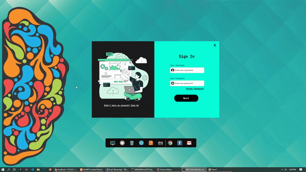

## 👋 Hello, Everyone

Ini adalah Winform UI Design Yang saya buat untuk aplikasi admin panel,dan ini dibuat ketika saya belajar c# dan sedikit bumbu UI dan UX
ya meskipun UI saya masih terkesan kurang bagus karena saya juga masih belajar hehe! UI Admin Panel Application ini akan saya kembangkan 
terus untuk mencapai hasil yang bagus dan maksimal, dan akhirnya UI ini sudah terintegrasi dengan database yang dimana ada user signup dan login
lalu ada sistem Admin panel dimana kita bisa update barang create barang delete barang karena pada dasarnya Admin Panel Application ini memakai 
fitur marketplace.kedepannya saya akan mengintegrasikan langsung Admin Panel Application ini dengan website marketplace yang saya akan buat,
entah itu akan menggunakan teknologi framework atau tidak. Semoga Kalian suka dengan Admin Panel Application ini
dan bisa kalian jadikan sebagai acuan media pembelajaran 😃
jika kalian ingin menggunakan UI ini atau template yang saya buat. Kalian harus memperhatikan
beberapa syarat yaa.

## 📌Beberapa Syaratnya :
  * Mempersiapkan Software Visual Studio 2019
  * Menginstall Package nuget
  * Menginstall Package MySQL Ver terbaru
  * Menginstall Connector MySQL
  * Gunakan Framework 4.7
  * Menginstall Package Guna UI dan Bunifu Frameworks
  * Mengumpulkan Mood yang banyak jika ingin mere-design UI ini. 😃

## 👩🏾‍💻 Cara Menginstall file ini

```bash
$ git clone https://github.com/ioofy/UILogin_DB.git

```
 * Lalu buka foldernya menggunakan Visual Studio 2019 buka folder ```Proj1.sln ```
 * Harap perhatikan Pada Bagian

```csharp
private MySqlConnection connection = new MySqlConnection
("datasource=localhost;port=3306;username=root;password=;database=panel_db");

```
* bagian database dan query tabel bisa kalian ganti dengan database yang kalian buat sendiri.
* dan jangan lupa untuk menginstall package yang saya sebutkan diatas.

## 📝 Catatan lain

 > Harap diperhatikan pula pada bagian Form1.Designer.cs.
 > Kalian harus memahami struktur UI yang dipakai karena jika ada yang tidak sinkron maka program akan otomatis error.

## 📷 Preview Signup dan Signin



## 📷 Preview Create Data


Terima Kasih😍 semoga kalian suka! jangan lupa kasih star ya! Dan jangan ragu pula untuk kontak saya di :
<p>
 <a href="https://www.instagram.com/rizukyy27_" target="_blank"></a>
 <a href="https://www.facebook.com/Rahxephonz" target="_blank"></a>
</p>

